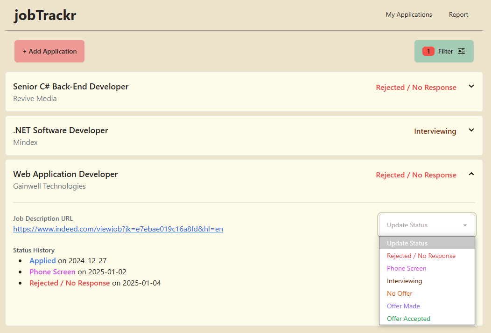

# JobTrackr
A simple job application status tracker. Built using Vue.js 3 with Typescript, TailwindCSS, DaisyUI, and .NET Minimal API

**Demo:** [https://applytrack.inmyroom.org/](https://applytrack.inmyroom.org/)

(Server/DB may be idle; wait 1-2 minutes if non-responsive)

